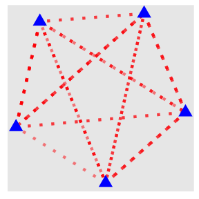
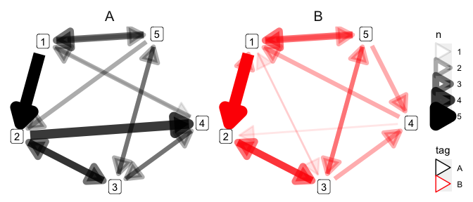

# Attach packages


```r
library(tidyverse)
library(tidygraph)
library(ggraph)
```

# Sample data

* Prepare a tibble with columns named `from` and `to`. 

* Each one contains the name of a node, and one column corresponds to one path.


```r
N <- 50

dat <-
  tibble(from = sample(1:5, N, replace = T),
         to = sample(1:5, N, replace = T))
```


```
## # A tibble: 50 x 2
##     from    to
##    <int> <int>
##  1     2     5
##  2     2     1
##  3     1     3
##  4     1     4
##  5     5     3
##  6     4     3
##  7     4     3
##  8     5     4
##  9     5     3
## 10     3     3
## # … with 40 more rows
```

# tbl_graph object

* Use the `as_tbl_graph()` function to convert the tibble into an object that can be handled by `ggraph()`.


```r
dat_graph <-
  dat %>% 
  as_tbl_graph()
```


```
## # A tbl_graph: 5 nodes and 50 edges
## #
## # A directed multigraph with 1 component
## #
## # Node Data: 5 x 1 (active)
##   name 
##   <chr>
## 1 2    
## 2 1    
## 3 5    
## 4 4    
## 5 3    
## #
## # Edge Data: 50 x 2
##    from    to
##   <int> <int>
## 1     1     3
## 2     1     2
## 3     2     5
## # … with 47 more rows
```

* Here you will find *Node Data* and *Edge Data*.

* If there is neither `from` nor `to`, the first two columns will be assigned respectively.

* If there is a `from` or `to` name, it will be found even if it is not the first column.


```r
tibble(A = sample(1:5, N, replace = T),
       B = sample(1:5, N, replace = T),
       C = sample(1:5, N, replace = T)) %>% 
  as_tbl_graph()
```

```
## # A tbl_graph: 5 nodes and 50 edges
## #
## # A directed multigraph with 1 component
## #
## # Node Data: 5 x 1 (active)
##   name 
##   <chr>
## 1 4    
## 2 2    
## 3 3    
## 4 1    
## 5 5    
## #
## # Edge Data: 50 x 3
##    from    to     C
##   <int> <int> <int>
## 1     1     1     3
## 2     2     2     2
## 3     3     1     3
## # … with 47 more rows
```

* Columns other than `from` and `to` will be stored in the *Edge Data* like this.


# Visualization

* Use `ggraph()` function at the position where you would normally use `ggplot()` function.

* Specific `geom_*()` functions are provided to draw the node and edge.


```r
dat_graph %>% 
  ggraph(layout = "stress") +
  geom_edge_link() +
  geom_node_point()
```

<!-- -->


* In these special geom_*() functions, the same arguments as usual can be specified.


```r
dat_graph %>% 
  ggraph(layout = "stress") +
  geom_edge_link(color = "Red", 
                 linetype = "dotted", 
                 alpha = 0.5, 
                 width = 1.5) +
  geom_node_point(color = "Blue",
                  size = 5,
                  shape = 17)
```

<!-- -->


* If the path contains paths that follow the same path, `geom_edge_fan()` function is useful.


```r
dat_graph %>% 
  ggraph(layout = "stress") +
  geom_edge_fan() +
  geom_node_label(aes(label = name))
```

<!-- -->


* The mapping specified by `aes()` function in the `geom_node_label()` function refers to *Node Data*. Therefore, the label argument should be `name`, where the name of the node is stored.

# Demonstration


```r
dat <-
  tibble(from = sample(1:5, N, replace = T),
         to = sample(1:5, N, replace = T),
         tag = rep(c("A", "B"), each = N/2)) %>% 
  group_by(from, to) %>% 
  mutate(n = n()) %>% 
  distinct() 
```


```
## # A tibble: 34 x 4
## # Groups:   from, to [22]
##     from    to tag       n
##    <int> <int> <chr> <int>
##  1     2     4 A         4
##  2     2     3 A         3
##  3     2     2 A         3
##  4     5     2 A         2
##  5     5     3 A         2
##  6     1     1 A         3
##  7     3     4 A         2
##  8     4     3 A         2
##  9     4     4 A         3
## 10     1     2 A         5
## # … with 24 more rows
```


```r
dat_graph <-
  dat %>% 
  as_tbl_graph(direction = T)
```


```
## # A tbl_graph: 5 nodes and 34 edges
## #
## # A directed multigraph with 1 component
## #
## # Node Data: 5 x 1 (active)
##   name 
##   <chr>
## 1 2    
## 2 5    
## 3 1    
## 4 3    
## 5 4    
## #
## # Edge Data: 34 x 4
##    from    to tag       n
##   <int> <int> <chr> <int>
## 1     1     5 A         4
## 2     1     4 A         3
## 3     1     1 A         3
## # … with 31 more rows
```


```r
dat_graph %>% 
  ggraph(layout = "stress") + 
  geom_edge_link(
    aes(color = tag, alpha = n, width = n),
    arrow = arrow(type = "closed"), 
    start_cap = circle(5, "mm"),
    end_cap = circle(5, "mm")
  ) +
  geom_node_label(aes(label = name)) +
  facet_wrap( ~ tag) +
  scale_edge_color_manual(values = c("Black", "red"))+
  theme(panel.background = element_rect(fill = "white"),
        strip.background = element_rect(fill = "white"),
        strip.text = element_text(size = 15))
```

<!-- -->


